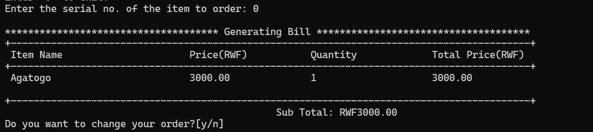
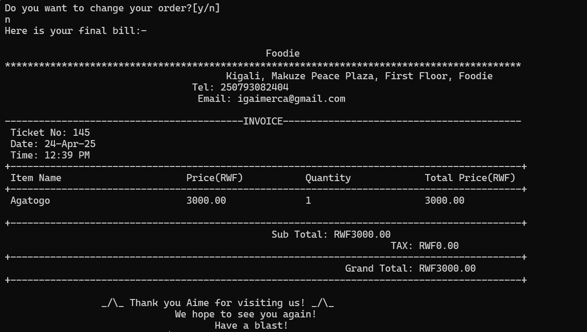

# Foodie





## Introduction

A food ordering application built with Go 

## Installation

* Clone this repo 

```bash
git clone https://github.com/igaimerca/go-foodie.git
```

* Change Directory

```bash
cd go-foodie
```

## Usage

To run this application, execute:

```bash
go run .
```

Then you are good to process :)

